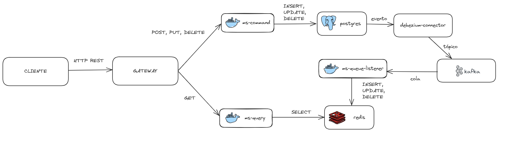

## Demo CQRS using Postgres+Redis and synchronization with Debezium-Kafka

The next diagram explains how are structured the microservices and how they communicate between them 

### Preparing the environment

1. Open a terminal in the folder environment-config

2. Run docker-compose.yml with the command: 
   * docker compose up -d

3. Connect to postgres with command: 
   * psql -h 127.0.0.1 -U postgres postgresdb

4. Run the next script into postgres and exit:
   * CREATE TABLE public."transaction" (
     id text NOT NULL,
     status text NOT NULL,
     input_mode text NOT NULL,
     receipt text NOT NULL,
     rrn text NOT NULL,
     "type" text NOT NULL,
     amount numeric(10, 2) NOT NULL,
     CONSTRAINT tranaction_pkey PRIMARY KEY (id)
     );

5. Set the connector to postgres with this command:

   * curl -X POST -H "Accept:application/json" -H "Content-Type:application/json" localhost:8083/connectors/ -d '
   {
   "name": "cqrs-test-connector",
   "config": {
   "connector.class": "io.debezium.connector.postgresql.PostgresConnector",
   "database.hostname": "postgres",
   "database.port": "5432",
   "database.user": "postgres",
   "database.password": "postgres",
   "database.dbname" : "postgresdb",
   "database.server.name": "dbserver1",
   "plugin.name": "pgoutput",
   "topic.prefix": "my_topic_prefix"
   }
   }'

6. Connect to kafka server with the command:
   * sudo docker exec -it kafka /bin/bash

7. Connect kafka to respective topic with the command:
   * kafka-console-consumer.sh --bootstrap-server kafka:9092 --topic my_topic_prefix.public.transaction --from-beginning 

### Running the application

1. Open every folder as a project:
   * command
   * queue-listener
   * query
2. Refresh gradle in every project
3. In command, run the main class : CommandApplication.java
4. In queue-listener, run the main class : QueueListenerApplication.java
5. In query, run the main class : QueryApplication.java

### Using the endpoints

1. To create a transaction you can use the command :
   * curl --location 'http://localhost:8080/api/transaction' 
   --header 'Content-Type: application/json' 
   --data '{
     "status" : "02",
     "inputMode" : "1234",
     "receipt" : "123456",
     "rrn" : "123456",
     "type" : "RETIRO",
     "amount" : 50000
     }'

2. To query a list of transactions you can use the command :
    * curl --location 'http://localhost:8082/api/transaction'